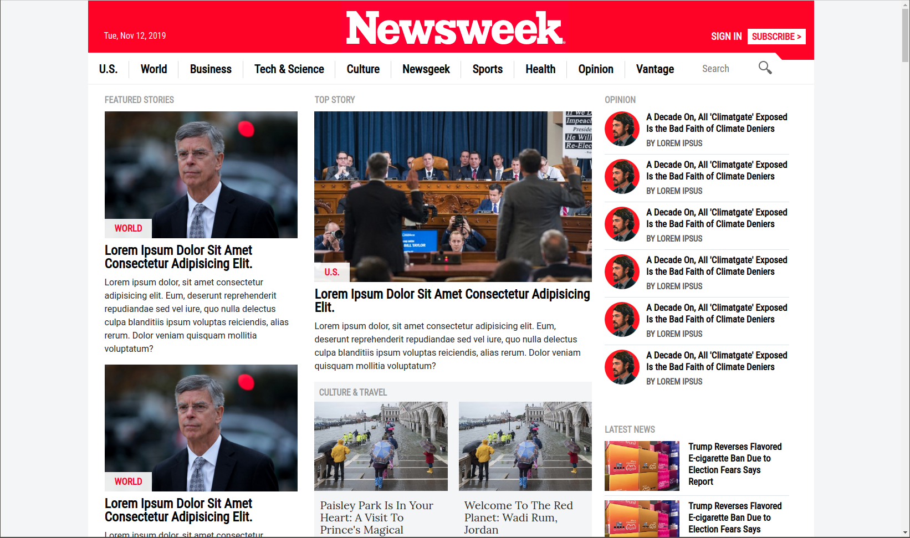

<!-- PROJECT LOGO -->
 

  <h2 align="center"> Responsive Web Design</h2>

  

    Project developed with HTML5 and CSS3 that shows a responsive web design of TheNextWeb homepage.
     
    <a href="https://github.com/queeksm/bootstrap-project"><strong>Explore the docs »</strong></a>
     
     
    <a href="https://github.com/queeksm/bootstrap-project">Report Bug</a>    
  

<!-- TABLE OF CONTENTS -->
## Table of Contents

* [About the Project](#about-the-project)
* [Built With](#built-with)
* [Contact](#contact)
* [Acknowledgements](#acknowledgements)

<!-- ABOUT THE PROJECT -->
## About The Project

This is a responsive web design based on TheNextWeb.

### Built With
The project was developed using these tools and technologies.
* [CSS3](https://developer.mozilla.org/en-US/docs/Web/CSS)
* [HTML5](https://www.w3schools.com/html/)
* [Reset CSS File](https://necolas.github.io/normalize.css/)
* [Bootstrap] (https://getbootstrap.com/)

<!-- CONTACT -->
## Contact

Andres Felipe Perez - [queeksm](https://github.com/queeksm) - queeksm@gmail.com

Project Link: [https://github.com/queeksm/bootstrap-project](https://github.com/queeksm/bootstrap-project)

<!-- ACKNOWLEDGEMENTS -->
## Acknowledgements
* [Normalize.css](https://necolas.github.io/normalize.css/)

